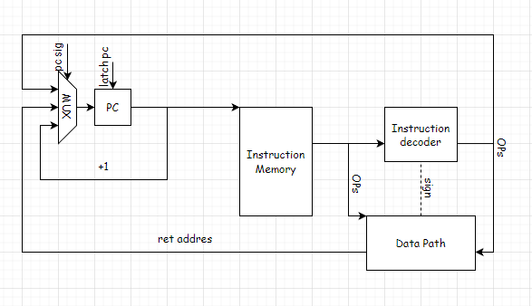

# Архитектура компьютера, 3 лабораторная
## Лузин Борис Евгеньевич P3207

Вариант: lisp -> asm | acc | harv | hw | tick -> instr | struct | stream | port | cstr | prob2 | cache

Базовый вариант: **lisp** | acc | harv | hw | **tick** | struct | stream | port | cstr | prob2

## Язык программирования - Lisp 
### Синтаксис языка
```ebnf
digit := '0' | '1' | '2' | ... | '9'
letter := 'a' | 'b' | 'c' | ... 'z'
number := '-'? digit*
string := <any symbol except a \0>
name := letter* | digit*
expression := 
    number | 
    string |
    name | 
    operation |
    '( ' expression* ' )'
```
### Пример кода
Программы пишутся в виде s-выражений. В рамках эксперимента, было принято решение:
запись выражений осуществляется строго через пробел от каждой сущности/скобочки.
Это позволило заметно упростить для меня написание транслятора.
```lisp
( var a 0 ) ( var b 1 ) ( var bound 400000 )
( while ( < b bound ) (
( if ( = 0 ( % b 2 ) ) ( + ( print b ) ( print _\0 ) ) ( + 0 0 ) )
( var tmp b )
( var b ( + a b ) )
( var a tmp ) ) );
```
Некоторые специальные формы, существующие в языке: \
(Больше информации можно получить, изучив тесты в папочке tests)
+ `var` - объявляет переменную, возвращает статус 1 при успехе
```text
( var name value )
```

+ `var_input` - объявляет переменную буфером value, полученную из flow_buffer, возвращает статус 1 при успехе
```text
( var_input value name ( flow_buffer ) )
```
+ `print` - подает на порт вывода строку или примитив, возвращает статус 1 при успехе
```text
( print value | variable | expression )
```
+ `while` - цикл типа do-while, сначала выполняется тело, после чего проверка, возвращает статус 1
```text
( while ( expression ) ( ( expression1 ) ( expression2 ) ... ) )
```
+ `read` - записывает в предварительно аллоцированную память поток ввода. Требует явного использования
var_input для аллокации.
```text
( var_input value name ( read ) )
```
+ `lisp_read` - в качестве эксперимента (цель лабы) написал реализацию на своём языке. 
Оставил обе, для наглядности разницы. Аналогична read, но писать было проще.
var_input для аллокации.
```text
( var_input value name ( lisp_read ) )
```
+ `if`, `мат операции для варианта` - повторяют логику их Lisp

## Организация памяти

Память организвана согласно Гарвардской модели, где память данных и инструкций не едины.

- Машинное слово – не определено. Реализуется высокоуровневой структурой данных.

- Доступен только аккумулятор

- Запись и Чтение из памяти осуществляется отдельными командами(load и store)

## Система команд

### Инструкции

#### Формат машинных инструкций
Все инструкции представлены в виде высокоуровневых структур:
```text
{"opcode": COMMAND_NAME, "addr_mod": ADDR_TYPE, "addr": VALUE, "term": TERM, OPTIONAL["comment": SOME USEFUL INFO]}
```
- Тип адресации - \
```nep_addr``` - непосредственная адресация \
```abs_addr``` - абсолютная адресация \
```tos_addr``` - стековая адресация \
```non_addr``` - адрес не требуется \
```con_tos_addr``` - косвенная стековая адресация

#### Инструкции загрузки/сохранения
`load` - Загрузить значение по адресу типа ADDR_TYPE со значением VALUE в аккумулятор.

`store` - Загрузить значение аккумулятора по адресу типа ADDR_TYPE со значением VALUE в память.

#### Инструкции ветвления
`jump` - Безусловный переход по адресу типа ADDR_TYPE со значением VALUE

`jump_if_zero` - Безусловный переход по адресу типа ADDR_TYPE со значением VALUE если выставлен флаг **Z**

`jump_if_not_zero` - Безусловный переход по адресу типа ADDR_TYPE со значением VALUE если не выставлен флаг **Z**

`jump_if_neg` - Безусловный переход по адресу типа ADDR_TYPE со значением VALUE если выставлен флаг **N**

`jump_if_not_neg` - Безусловный переход по адресу типа ADDR_TYPE со значением VALUE если не выставлен флаг **N**

#### Арифметические операции (минимальное надмножество для решения задачи)
`increment` - инкремент аккумулятора

`decrement` - декремент аккумулятора

`add` - Сложение аккумулятора со значением по адресу типа ADDR_TYPE со значением VALUE

`sub` - Вычитание аккумулятора со значением по адресу типа ADDR_TYPE со значением VALUE 

`mod` - Взятие модуля от аккумулятора со значением по адресу типа ADDR_TYPE со значением VALUE

#### Операции со стеком
`push` - Положить на стек значение аккумулятора 

`pop` - Снять со стека значение и положить в аккумулятор

`clean_head` - Снять со стека значение и положить в аккумулятор, уменьшив указатель стека на 2

#### Операции ввода-вывода
`in` - Считать данные с внешнего устройства в регистр аккумулятор

`out` - Отправить значение аккумулятора на внешнее устройство

#### Остальные операции
`halt` - Остановка процессора

## Транслятор
Интерфейс командной строки: `python translator.py <input_file> <target_file>`

Трансляция происходит в 2 этапа:
- Парсинг текста программы и преобразование его в дерево для поддержания любого уровня вложенности
- Генерация машинного кода для каждого листика, снизу вверх

## Модель процессора
Интерфейс командной строки: `python machine.py <code_file> <input_file>`

### Control Unit
 \
Control Unit включает в себя декодер инструкций, указатель инструкций и память инструкций.

+ Память инструкций хранит в себе инструкции, отдельно от данных.

+ В указатель инструкций может быть защелкнуто значение по безусловному переходу (из декордера),
получение значения следующей инструкции, или будет возвращено из DataPath. 

+ За счет маскирования бит, DataPath получает адрес из тела инструкции. \
На схеме упрощено для наглядности.

### Datapath
 \
DataPath включает в себя память данных, sp, АЛУ, аккумулятор и флаги.

+ Отвечает за ввод вывод на контроллер (`IO cont`) \
На схеме упрощено для наглядности
+ Память идет напрямую в алу
+ На левый вход подается аккумулятор / данные для аккумулятора / sp.
+ На правый вход подается память или адрес из выбранной команды
На схеме упрощено для наглядности.
+ Выход с АЛУ разтраивается и защелкивается только в нужных для операции местах
+ На "конце" памяти есть стек, растущий вверх
+ Писать в память можно только из аккумулятора


#### Флаги
В результате выполнения операции АЛУ выставляет 2 флага:
- zero - результат операции равен нулю
- neg - результат операции отрицателен


## Тестирование
Тестирование настроено с помощью гитхаб акшнс, yml для сборки ci содержит описание каждого из шагов тестирования
+ Установка зависимостей для тестирования
+ Линтинг утилитой ruff
+ Исполнение golden тестов для 3х обязательных программ и prob2
Пример файла логов с потактовым логгированием (важные операции дополнительно соотнесены с их термами)
```text
  NUM -> ALU_RG
  TICK:   1 PC:   0 ADDR:   0 MEM_OUT: 0 ACC: 0 LG_ALU:   0 RG_ALU:   1 SP: 4000 ZF: 1 |	load   var
  ALU_RES = ALU_RG
  TICK:   2 PC:   0 ADDR:   0 MEM_OUT: 0 ACC: 0 LG_ALU:   0 RG_ALU:   1 SP: 4000 ZF: 0 |	load   var
  ALU_RES -> ACC
  TICK:   3 PC:   0 ADDR:   0 MEM_OUT: 0 ACC: 1 LG_ALU:   0 RG_ALU:   1 SP: 4000 ZF: 0 |	load   var
  SP -> ALU_LG
  TICK:   4 PC:   1 ADDR:   0 MEM_OUT: 0 ACC: 1 LG_ALU: 4000 RG_ALU:   1 SP: 4000 ZF: 0 |	push   var
  ALU_RES = SP - 1
  TICK:   5 PC:   1 ADDR:   0 MEM_OUT: 0 ACC: 1 LG_ALU: 4000 RG_ALU:   1 SP: 4000 ZF: 0 |	push   var
  ALU_RES -> SP
  TICK:   6 PC:   1 ADDR:   0 MEM_OUT: 0 ACC: 1 LG_ALU: 4000 RG_ALU:   1 SP: 3999 ZF: 0 |	push   var
  WRITE ACC -> MEM[ALU]
  TICK:   6 PC:   1 ADDR:   0 MEM_OUT: 0 ACC: 1 LG_ALU: 4000 RG_ALU:   1 SP: 3999 ZF: 0 |	push   var
  NUM -> ALU_RG
  TICK:   7 PC:   2 ADDR:   0 MEM_OUT: 0 ACC: 1 LG_ALU: 4000 RG_ALU:   1 SP: 3999 ZF: 0 |	load   var
  ALU_RES = ALU_RG
  TICK:   8 PC:   2 ADDR:   0 MEM_OUT: 0 ACC: 1 LG_ALU: 4000 RG_ALU:   1 SP: 3999 ZF: 0 |	load   var
  ALU_RES -> ACC
  TICK:   9 PC:   2 ADDR:   0 MEM_OUT: 0 ACC: 1 LG_ALU: 4000 RG_ALU:   1 SP: 3999 ZF: 0 |	load   var
  SP -> ALU_LG
  TICK:  10 PC:   3 ADDR:   0 MEM_OUT: 0 ACC: 1 LG_ALU: 3999 RG_ALU:   1 SP: 3999 ZF: 0 |	push   var
  ALU_RES = SP - 1
  TICK:  11 PC:   3 ADDR:   0 MEM_OUT: 0 ACC: 1 LG_ALU: 3999 RG_ALU:   1 SP: 3999 ZF: 0 |	push   var
  ALU_RES -> SP
  TICK:  12 PC:   3 ADDR:   0 MEM_OUT: 0 ACC: 1 LG_ALU: 3999 RG_ALU:   1 SP: 3998 ZF: 0 |	push   var
  WRITE ACC -> MEM[ALU]
  TICK:  12 PC:   3 ADDR:   0 MEM_OUT: 0 ACC: 1 LG_ALU: 3999 RG_ALU:   1 SP: 3998 ZF: 0 |	push   var
  NUM -> ALU_RG
  TICK:  13 PC:   4 ADDR:   0 MEM_OUT: 0 ACC: 1 LG_ALU: 3999 RG_ALU:   1 SP: 3998 ZF: 0 |	load   var
  ALU_RES = ALU_RG
  TICK:  14 PC:   4 ADDR:   0 MEM_OUT: 0 ACC: 1 LG_ALU: 3999 RG_ALU:   1 SP: 3998 ZF: 0 |	load   var
  ALU_RES -> ACC
  TICK:  15 PC:   4 ADDR:   0 MEM_OUT: 0 ACC: 1 LG_ALU: 3999 RG_ALU:   1 SP: 3998 ZF: 0 |	load   var
  SP -> ALU_LG
  TICK:  16 PC:   5 ADDR:   0 MEM_OUT: 0 ACC: 1 LG_ALU: 3998 RG_ALU:   1 SP: 3998 ZF: 0 |	push   var
  ALU_RES = SP - 1
  TICK:  17 PC:   5 ADDR:   0 MEM_OUT: 0 ACC: 1 LG_ALU: 3998 RG_ALU:   1 SP: 3998 ZF: 0 |	push   var
  ALU_RES -> SP
  TICK:  18 PC:   5 ADDR:   0 MEM_OUT: 0 ACC: 1 LG_ALU: 3998 RG_ALU:   1 SP: 3997 ZF: 0 |	push   var
  WRITE ACC -> MEM[ALU]
  TICK:  18 PC:   5 ADDR:   0 MEM_OUT: 0 ACC: 1 LG_ALU: 3998 RG_ALU:   1 SP: 3997 ZF: 0 |	push   var
  ADDR -> PC
  ADDR -> ALU_RG
  TICK:  20 PC:  24 ADDR:   0 MEM_OUT: 0 ACC: 1 LG_ALU: 3998 RG_ALU:   6 SP: 3997 ZF: 0 |	load
  ALU_RES = ALU_RG
  TICK:  21 PC:  24 ADDR:   0 MEM_OUT: 0 ACC: 1 LG_ALU: 3998 RG_ALU:   6 SP: 3997 ZF: 0 |	load
  READ MEM[ALU]
  TICK:  22 PC:  24 ADDR:   0 MEM_OUT: 1 ACC: 1 LG_ALU: 3998 RG_ALU:   6 SP: 3997 ZF: 0 |	load
  MEM[ALU] -> ALU_RG
  TICK:  23 PC:  24 ADDR:   0 MEM_OUT: 1 ACC: 1 LG_ALU: 3998 RG_ALU:   1 SP: 3997 ZF: 0 |	load
  ALU_RES = ALU_RG
  TICK:  24 PC:  24 ADDR:   0 MEM_OUT: 1 ACC: 1 LG_ALU: 3998 RG_ALU:   1 SP: 3997 ZF: 0 |	load
  ALU_RES -> ACC
  TICK:  25 PC:  24 ADDR:   0 MEM_OUT: 1 ACC: 1 LG_ALU: 3998 RG_ALU:   1 SP: 3997 ZF: 0 |	load
  NUM -> ALU_RG
  TICK:  26 PC:  25 ADDR:   0 MEM_OUT: 1 ACC: 1 LG_ALU: 3998 RG_ALU:   2 SP: 3997 ZF: 0 |	mod
  ACC -> ALU_LG
  TICK:  26 PC:  25 ADDR:   0 MEM_OUT: 1 ACC: 1 LG_ALU:   1 RG_ALU:   2 SP: 3997 ZF: 0 |	mod
  ALU_RES = ALU_LG % ALU_RG
  TICK:  27 PC:  25 ADDR:   0 MEM_OUT: 1 ACC: 1 LG_ALU:   1 RG_ALU:   2 SP: 3997 ZF: 0 |	mod
  ALU_RES -> ACC
  TICK:  28 PC:  25 ADDR:   0 MEM_OUT: 1 ACC: 1 LG_ALU:   1 RG_ALU:   2 SP: 3997 ZF: 0 |	mod
  SP -> ALU_LG
  TICK:  29 PC:  26 ADDR:   0 MEM_OUT: 1 ACC: 1 LG_ALU: 3997 RG_ALU:   2 SP: 3997 ZF: 0 |	push
  ALU_RES = SP - 1
  TICK:  30 PC:  26 ADDR:   0 MEM_OUT: 1 ACC: 1 LG_ALU: 3997 RG_ALU:   2 SP: 3997 ZF: 0 |	push
  ALU_RES -> SP
  TICK:  31 PC:  26 ADDR:   0 MEM_OUT: 1 ACC: 1 LG_ALU: 3997 RG_ALU:   2 SP: 3996 ZF: 0 |	push
  WRITE ACC -> MEM[ALU]
  TICK:  31 PC:  26 ADDR:   0 MEM_OUT: 1 ACC: 1 LG_ALU: 3997 RG_ALU:   2 SP: 3996 ZF: 0 |	push
```

```text
| Лузин Борис Евгеньевич | cat | 2 | - | 23 | 1101 | lisp | acc | harv | hw | tick | struct | stream | port | cstr | prob2 |
| Лузин Борис Евгеньевич | hello | 1 | - | 14 | 14 | lisp | acc | harv | hw | tick | struct | stream | port | cstr | prob2 |
| Лузин Борис Евгеньевич | hello_user_name | 1 | - | 103 | 272 | lisp | acc | harv | hw | tick | struct | stream | port | cstr | prob2 |
| Лузин Борис Евгеньевич | prob2 | 7 | - | 66 | 1197 | lisp | acc | harv | hw | tick | struct | stream | port | cstr | prob2 |
```
